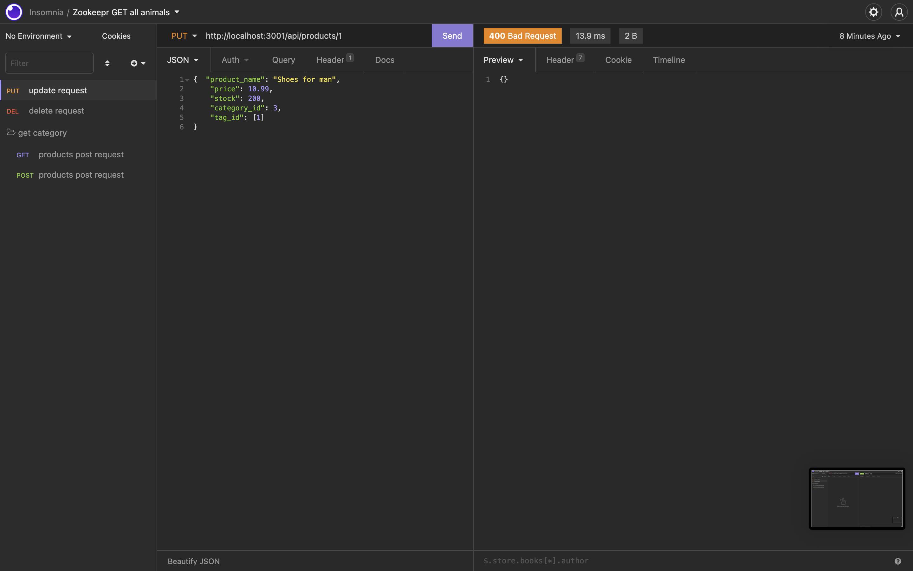
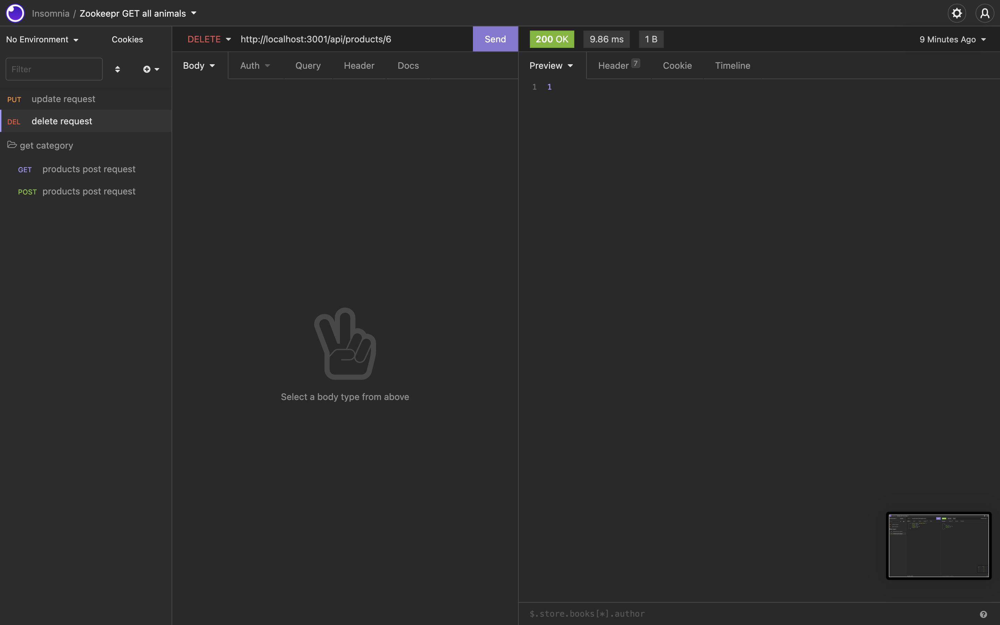
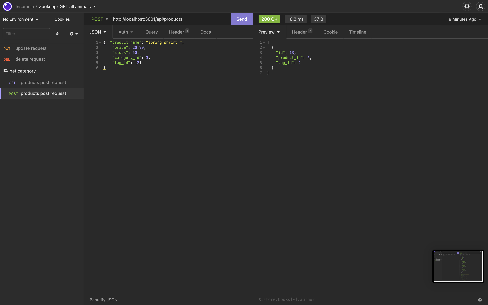
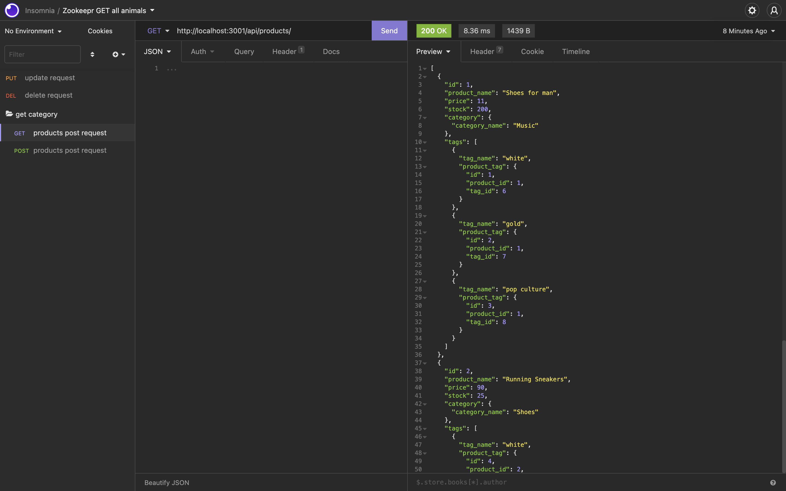

# Unit 12 MySQL Homework: MB-E-COMMERCE-

## Description 
🔍 A mysql database and application backend for an e-commerce site. Built using MySQL2, Express, Sequelize and dotenv.

💻 Below is the gif showing the functionality of the application:

### App working example

  
[Video Link App Working]
(public/video.gif)

### App Screen Shots

 
   

## Table of contents

- [Description](#Description)
- [App Working Example](#Description)
- [Installation](#Installation)
- [Usage](#Usage)
- [Licence](#Licence)
- [Repository Link](#Repository)
- [GitHub Info](#GitHub) 

## Installation
Run:

                npm i

## Usage

This command-line application allows the user to:

  * Add departments, roles, employees

  * View departments, roles, employees

  * Update employee roles

 

  * Delete departments, roles, and employees

The application will be invoked with the following command:

                npm start
## Licence

## walkthrough videp link :
(https://drive.google.com/file/d/1e271s3GByZB1pKJJfCKqePS_LbOIcTZA/view)
## Repository

- [Project Repo](https://github.com/mohamed0228/MB-E-commerce-)

## GitHub

- mohammed boussaada
- [GitHub Profile](https://github.com/mohamed0228)
## Contribution
Made with ❤️ by [MOHAMMED BOUSSAADA]